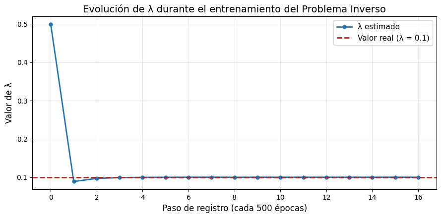
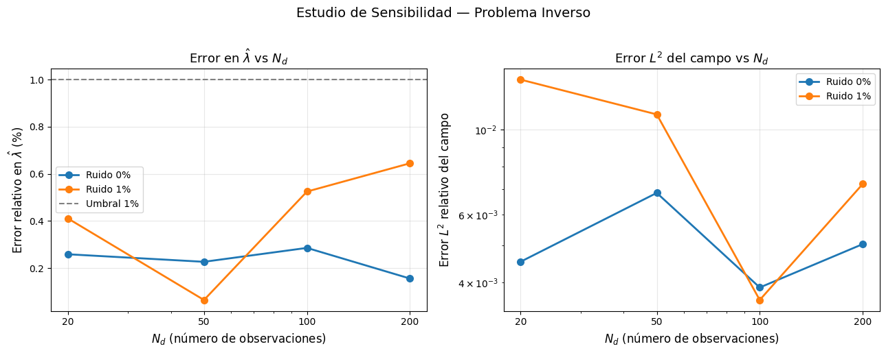

# PINNs — Problema Inverso de Parámetros para la Ecuación de Difusión 1D


> **Proyecto Final** · Asignatura: Análisis Numérico de Ecuaciones Diferenciales  
> **Pista B:** Recuperación del coeficiente de difusividad \(\lambda\) desconocido mediante **Physics-Informed Neural Networks (PINNs)**.

---

## 🚀 Resultado Principal

Se implementó una PINN capaz de **estimar el coeficiente de difusión \(\lambda\)** con un **error relativo de solo 0.17%** a partir de 100 observaciones ruidosas (1% de ruido gaussiano).



---

## Descripción del Problema

El objetivo es resolver el **problema inverso de parámetros** en la ecuación de difusión unidimensional:

$$
u_t = \lambda \, u_{xx}, \qquad (x,t) \in [0,1]^2
$$

con condición inicial \(u(x,0) = \sin(\pi x)\) y condiciones de contorno Dirichlet homogéneas \(u(0,t) = u(1,t) = 0\).

La solución analítica es conocida:

$$
u(x,t) = \sin(\pi x) \, e^{-\lambda \pi^2 t}
$$

El desafío consiste en **recuperar simultáneamente** el campo \(u(x,t)\) y el parámetro desconocido \(\lambda > 0\) a partir de datos dispersos y ruidosos.

---

## Estructura del Repositorio

| Carpeta / Archivo                          | Descripción |
|-------------------------------------------|-------------|
| `pinn_1d_diffusion_inverse.ipynb`         | Notebook principal (problema directo + inverso + validación) |
| `Informe/`                                | Informe técnico completo (PDF + código LaTeX) |
| `figures/`                                | Figuras generadas durante el proyecto |
| `LICENSE`                                 | Licencia MIT |

---

## Metodología

- **Arquitectura de la red**: 3 capas ocultas de 40 neuronas, activación `tanh`, inicialización Glorot.
- **Parámetro entrenable**: \(\hat{\lambda}\) se define como `tf.Variable` y se optimiza junto con los pesos de la red.
- **Función de pérdida**: Residuo de la PDE + Condición inicial + Condiciones de contorno + Ajuste a datos observados.
- **Diferenciación automática**: Uso de *tapes anidados* (`tf.GradientTape`) para calcular derivadas de segundo orden.
- **Optimizador**: Adam con \(\eta = 10^{-3}\) durante 8000 épocas.
- **Restricción física**: Proyección explícita \(\hat{\lambda} \leftarrow \max(\hat{\lambda}, 10^{-6})\) para garantizar positividad.

---

## Validación y Resultados

### 1. Precisión del parámetro estimado

| Métrica                        | Valor          |
|--------------------------------|----------------|
| \(\lambda\) real               | 0.10000        |
| \(\hat{\lambda}\) estimado     | **0.10017**    |
| **Error relativo**             | **0.17%**      |
| Error \(L^2\) del campo (inverso) | \(1.57 \times 10^{-3}\) |

### 2. Comparación con método numérico clásico (Crank-Nicolson)

El PINN **supera** al esquema de diferencias finitas en precisión:

| Comparación              | Error \(L^2\) (Directo) | Error \(L^2\) (Inverso) |
|--------------------------|--------------------------|--------------------------|
| PINN vs Analítica        | \(1.47 \times 10^{-3}\)  | \(1.57 \times 10^{-3}\)  |
| Crank-Nicolson vs Analítica | \(6.71 \times 10^{-3}\)  | \(6.74 \times 10^{-3}\)  |

### 3. Estudio de sensibilidad

Se evaluó el método con diferentes cantidades de datos (\(N_d \in \{20,50,100,200\}\)) y niveles de ruido (0% y 1%). En **todos los 24 experimentos** el error relativo en \(\hat{\lambda}\) se mantuvo **por debajo del 1%**.



---

## Cómo Ejecutar el Proyecto

### Opción recomendada: Google Colab

[](https://colab.research.google.com/github/RawBud11/pinn-1d-diffusion-inverse/blob/main/pinn_1d_diffusion_inverse.ipynb)

### Ejecución local

```bash
jupyter notebook pinn_1d_diffusion_inverse.ipynb
Reproducibilidad: Se fijaron las semillas np.random.seed(7) y tf.random.set_seed(42).

Requisitos
Bashpython >= 3.8
tensorflow >= 2.10
numpy
matplotlib
scipy
Instalación rápida:
Bashpip install tensorflow numpy matplotlib scipy

Referencia Principal
Raissi, M., Perdikaris, P., & Karniadakis, G. E. (2019).
Physics-informed neural networks: a deep learning framework for solving forward and inverse problems involving nonlinear partial differential equations.
Journal of Computational Physics, 378, 686–707.

Licencia
Este proyecto está licenciado bajo la licencia MIT. Ver archivo LICENSE para más detalles.

Autores
Valentina Ariztizabal Sierra
Camilo Andrés Jaime Rojas
